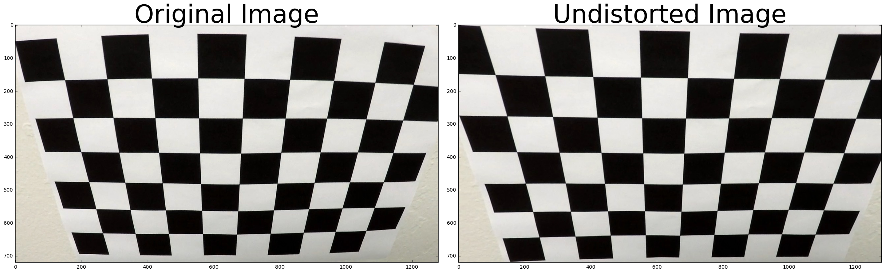
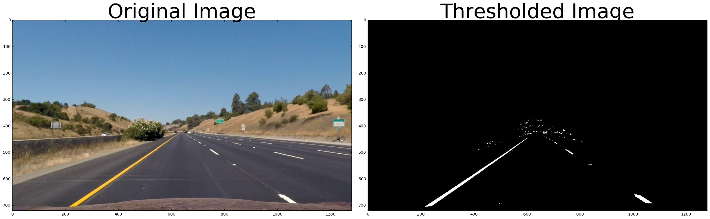
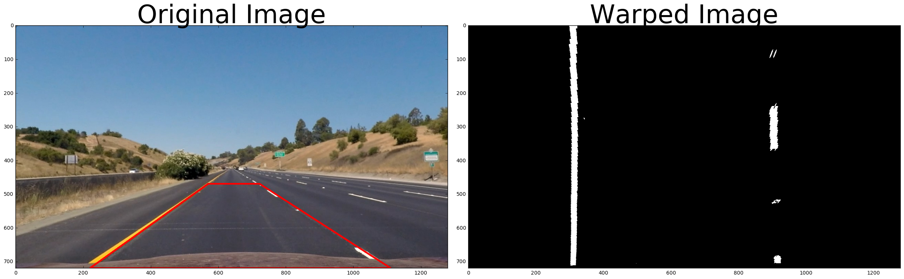
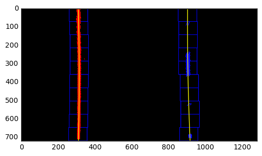
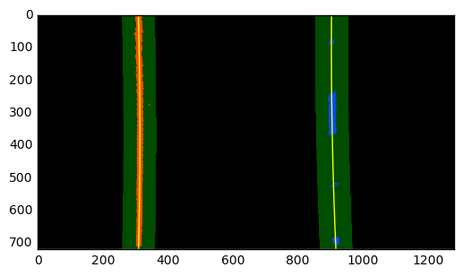
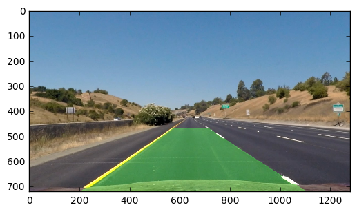
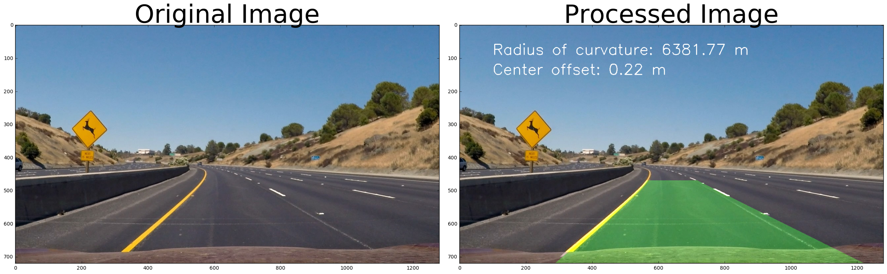

## Advanced Lane Finding

This repository contains code for a project I did as a part of [Udacity's Self Driving Car Nano Degree Program](https://www.udacity.com/drive). The goal is to write a software pipeline to identify the road lane boundaries in a video.

The Steps
---

The steps of this project are listed below. You can have a look at [Advanced_Lane_Lines.ipynb](Advanced_Lane_Lines.ipynb) for the code.

###Distortion Correction

The images for camera calibration are stored in the folder called `camera_cal`. I compute the camera matrix and distortion co-efficients to undistort the image.

###Gradients and color thresholds.
I applied thresholds on gradients and colors (in RGB and HLS color spaces) to obtain a binary thresholded image.

###Perspective transform ("birds-eye view").
After manually examining a sample image, I extracted the vertices to perform a perspective transform. The polygon with these vertices is drawn on the image for visualization. Destination points are chosen such that straight lanes appear more or less parallel in the transformed image.

###Detect lane pixels (sliding window search).
I then perform a sliding window search, starting with the base likely positions of the 2 lanes, calculated from the histogram. I have used 10 windows of width 100 pixels.

The x & y coordinates of non zeros pixels are found, a polynomial is fit for these coordinates and the lane lines are drawn.

###Searching around previosly detected lane line
Since consecutive frames are likely to have lane lines in roughly similar positions, we search around a margin of 50 pixels of the previously detected lane lines.

###Inverse transform and output
For the final image we:
 1. Paint the lane area
 2. Perform an inverse perspective transform
 3. Combine the precessed image with the original image.

###Example Result
We apply the pipeline to a test image. The original image and the processed image are shown side by side.

The Video
---
The pipeline is applied to a video. Click on the image to watch the video or [click here](https://youtu.be/LJc_GhtzSCY). You will be redirected to YouTube.

The Challenge
---
The `challenge_video.mp4` video is an extra (and optional) challenge for testing the pipeline under somewhat trickier conditions. Click on the image to watch the video or [click here](https://youtu.be/HQsfKj4Shp0). You will be redirected to YouTube.

Discussion
---

## Issues and Challenges

### Gradient & Color Thresholding
1. I had to experiment a lot with gradient and color channnel thresholding.
2. The lanes lines in the challenge and harder challenge videos were extremely difficult to detect. They were either too bright or too dull. This prompted me to have R & G channel thresholding and L channel thresholding

### Bad Frames
1. The challenge video has a section where the car goes underneath a tunnel and no lanes are detected
2. To tackle this I had to resort to averaging over the previous well detected frames
3. The lanes in the challenge video change in color, shape and direction. I had to experiment with color threholds to tackle this. Ultimately I had to make use of R, G channels and L channel thresholds.

## Points of failure & Areas of Improvement

The pipeline seems to fail for the harder challenge video. This video has sharper turns and at very short intervals.I think what I could improve is:
1. Take a better perspective transform: choose a smaller section to take the transform since this video has sharper turns and the lenght of a lane is shorter than the previous videos.
2. Average over a smaller number of frames. Right now I am averaging over 12 frames. This fails for the harder challenge video since the shape and direction of lanes changes quite fast.